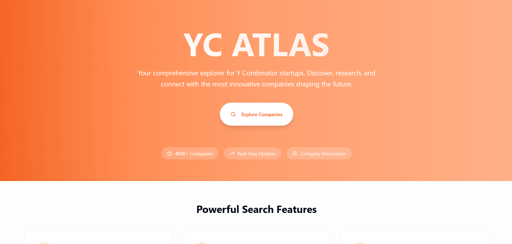

# YC ATLAS

## Overview
YC ATLAS is an open-source deep researcher tool that automates the discovery of Y Combinator startups based on specific technology domains, mission statements, and business models. It eliminates the need for manual research, which can be time-consuming and often yields incomplete results.

## Problem Statement
Manual research to find YC startups is time-consuming – often requiring hours spent sifting through fragmented data across multiple sources. Traditional search methods often miss relevant companies or return outdated information.

## Solution
YC ATLAS provides an agentic AI-powered search system that autonomously conducts multi-step searches to find the most relevant YC startups based on your queries. It combines the power of LLMs with vector search to understand context and deliver accurate results.

## How It Works

As shown in the system diagram:

1. **Initial Query**: User submits a query (e.g., "Company that works in RAG")
2. **Query Expansion**: The LLM generates multiple related queries to expand search scope
3. **Query Enhancement**: Each related query is AI-enhanced in parallel
4. **Parallel Embedding**: All enhanced queries are converted to vector embeddings simultaneously
5. **Parallel Similarity Search**: Multiple vector searches are conducted in parallel
6. **Result Aggregation**: Results from all parallel searches are combined and ranked
7. **Final Output**: User receives a comprehensive, ranked list of relevant YC startups

## Key Features

### Agentic Flow & Context-Aware Retrieval
- Utilizes LLM-powered semantic search to understand and refine your queries
- Generates multiple related questions to expand the search scope
- Processes all queries in parallel for maximum efficiency

### Deep Research Capabilities
- Finds companies based on technology stack, mission, and business model
- Example: Search "Company that works in RAG" to find every YC startup in the RAG, Finetuning LLM, and AI Agents space

### Current Data
- Provides a current snapshot of the startup ecosystem
- Cuts through static, outdated information
- Regularly updated database of YC companies

## Technology Stack

- **OpenAI API**: For query understanding, enhancement, and embedding generation
- **Vector Embedding**: Text-embedding-3-large model for semantic understanding
- **Pinecone**: Vector database for efficient similarity search
- **FastAPI**: Backend API framework for handling requests
- **Concurrent Processing**: ThreadPoolExecutor for parallel query processing
- **Selenium**: For data collection (mentioned in project description)
- **Crawl4AI**: For data extraction (mentioned in project description)
- **Async**: For efficient data processing
- **Streamlit**: For the user interface (mentioned in project description)

## API Endpoints

### `/search_companies`
Simple search endpoint that processes a single query.

### `/deep_research`
Advanced search endpoint that generates multiple related questions from the initial query, enhances each in parallel, generates embeddings in parallel, conducts similarity searches in parallel, and then aggregates results.

## Installation

```bash
# Clone the repository
git clone https://github.com/your-username/yc-atlas.git
cd yc-atlas

# Install dependencies
pip install -r requirements.txt

# Set up environment variables
cp .env.example .env
# Add your API keys to the .env file:
# OPENAI_API_KEY=your_openai_api_key
# PINECONE_API_KEY=your_pinecone_api_key
# PINECONE_HOST_URL2=your_pinecone_host_url

# Run the application
uvicorn main:app --reload
```

## Usage

### API Example

```python
import requests

# Simple search
response = requests.post(
    "http://localhost:8000/search_companies",
    json={"query": "Company that works in RAG"}
)
print(response.json())

# Deep research
response = requests.post(
    "http://localhost:8000/deep_research",
    json={"query": "Company that works in RAG"}
)
print(response.json())
```

### UI Example

Navigate to the Streamlit interface at `http://localhost:8501` and enter your search query.

## Contributing

Contributions are welcome! Please feel free to submit a Pull Request.

## License

This project is licensed under the MIT License - see the LICENSE file for details.

